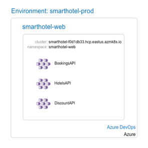

## Environments in Azure DevOps

Environment represents the resources targeted by pipelines, for example, Kubernetes clusters, app services, virtual machines, service fabric clusters etc.  Typical examples of environments are **Development**, **Test**, **QA**, and **Production**

### Why build it?

- To provide traceability from code to the physical deployment targets
- Improved visibility of resource health/availability
- Support zero downtime deployments using deployment strategies – upgrade confidently!

## Defining environments

Environment is composed of **groups of resources**. For example, a **production** environment composed with a farm of **web** servers, **database** clusters, and other services. 

By defining the environment in Azure DevOps, you describe where the code gets deployed. Deployments are created when the pipeline job deploys a new version of the code to the environment. 

Environment at its simplest form is just a string. The pipeline can discover and register the environment. Each time a job is run with above data, the deployment will be recorded against the environment.

For example,

```yaml
pool:
  vmImage: 'Ubuntu 16.04'
environment: 
  name: smarthotel-prod               # creates an environment 'smarhotel-prod' and records deployments against it.
```
With the above, deployment history from multiple pipelines are enabled. 


## Environment with multiple resources



Figure: **a**

In the above illustration, we have 3 **namespaces** in the environment that map to -
- A resource group with one or more App Services, 
- A resource group with one or more Databases, and 
- A Kubernetes *namespace* in a cluster with one or more containerized apps (workloads) 

**Note**: 
- **namespace**: represents **group of resources** that are homogeneous. You can apply deployment strategy on the resource within a namespace. 
- **terminology**: Other options for **namespace** were **resources**, **serviceGroup** among others, open to feedback. 
- **resource discovery**: Current YAML scope is limited to creating an environment and tracking the deployments. Future, we can annotate system tasks to publish the resources (provisioned/targeted) to the environment.

### Deployment job & Environment

We will be introducing a new a `job` type called `deployment`, that can create and record deployments against the `environment`. In other words, a `deployment` job is a collection of steps to be run against the `environment`.

```yaml
- deployment: deployWeb
  displayName: Deploy web pkg
  pool:
    vmImage: 'Ubuntu 16.04'
  environment:
    name: production    # create environment and/or record deployments
  steps:
  - script: echo deploy web pkg
```

**Note**: Existing `job` supports `matrix` and `parallel` strategies, adding `environment` support to it would add additional exclusive strategies viz. `canary`, `blueGreen`, and `rolling` to the mix. 

### Resources in an environment

Target and record deployments against each group of resource in an environment. For example, an environment having web, database, and backend services. 

For example 

```yaml
jobs:
- deployment:
  environment: 
    name: smarthotel-prod
    namespace:  smarthotel-web          #alias for the group, another option is to name this as 'serviceGroup'
  pool:
    name: sh-prod-pool
  steps:
  - task: AzureWebApp                 # inherits resource connection from environment
      appName: 'smarthotel'
```

### Full example with multiple namespaces


```yaml
jobs:
- deployment: deployWeb
  environment: 
    name: SmartHotel-prod
    namespace:  smarthotel-web        #alias for the group, another option is to name this as 'serviceGroup'
  pool:
    name: sh-prod-pool
  steps:
  - task: AzureWebApp                 # inherits resource connection from environment
      appName: 'smarthotel'
- deployment: deployBackend
  environment: 
    name: smarthotel-prod
    namespace:  prodservice          
  pool:
    name: sh-prod-pool
  steps:
  - script: docker run...
- deployment: deployDB
  environment: 
    name: smarthotel-prod
    namespace:  smarthotel-database          
  pool:
    name: sh-prod-pool
  steps:
  - script: deploy sql script...
```

### Environment with a single resource

In the context of a `deployment` job, when the associated `environment` has a single WebApp, Providing just the task and app name should suffice. Information about the namespace, service connection are optional. 

For example as below

```yaml
jobs:
- deployment:
  environment: 
    name: smarthotel-prod
  pool:
    name: sh-prod-pool
  steps:
  - task: AzureWebApp                         # or inherits resource connection from environment
      appName: 'smarthotel'
```

Or  use the environment variables, for example,

```yaml
jobs:
- deployment:
  environment: 
    name: smarthotel-prod
    namespace: smarthotel-web
  pool:
    name: sh-prod-pool
  steps:
  - task: AzureWebApp  
    displayName: 'Azure WebApp: smarthotel'
    inputs:
      azureSubscription: $(environment.namespace.connection)  
      appName: 'smarthotel'                                      
      #package: '$(build.artifactstagingdirectory)/**/*.zip'       # can work with *.war, *.jar or a folder
```

## Future (discussion only)
`canary`, `blue-green`, and `rolling` strategies supported by `deployment` job. 

**Blue-Green**: Reduce deployment downtime by having identical standby environment. At any time one of them, let's say `blue` for the example, is live. As you prepare a new release of your software you do your final stage of testing in the green environment. Once the software is working in the green environment, you switch the traffic so that all incoming requests go to the green environment - the blue one is now idle.

For example, 

```yaml
jobs:
- job: Build
  strategy:
    matrix:
      Python35:
        PYTHON_VERSION: '3.5'
      Python36:
        PYTHON_VERSION: '3.6'
  steps:
  - script: echo build/package app 
- deployment: deployWebPkg
  pool:
    image: 'Ubuntu 16.04'
  environment:
    name:  musicCarnivalQA
    resource: smarthotel-web
  steps:
   - task: AzureWebApp                       
      appName: 'smarthotel'
      slot: staging
  strategy:                                # blue green/rolling/canary
    blueGreen:
 
      healthCheck:
        checks:           #  gates job
        - task: appInsightsAlerts
        timeout: 60m   
 
      swap:
        steps:
        - task: swapSlots
            inputs:
              appName: smarthotel
              slot: production

      healthCheck:
        checks:
        - task: appInsightsAlerts
        timeout: 60m
 
      onChecksFailure:
        steps:
        - task: swapSlots
            inputs:
              appName: smarthotel
        - task: notify
 
      onChecksPass:
      - script: echo 'checks passed...'

```

**Note**: (**WIP**)Another option is to have typed blueGreen step. For example, typed K8S-blue-green deploy step that works with manifest yaml file. 
